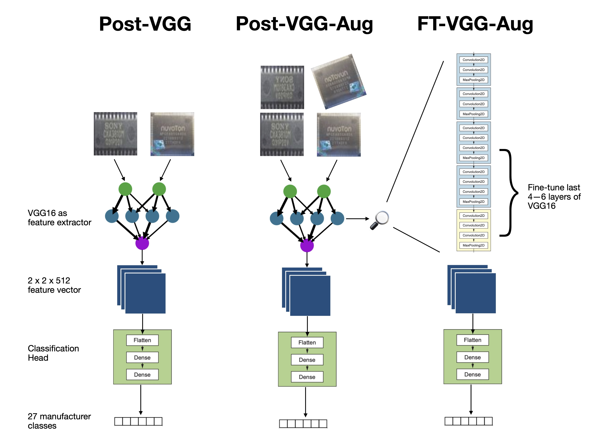
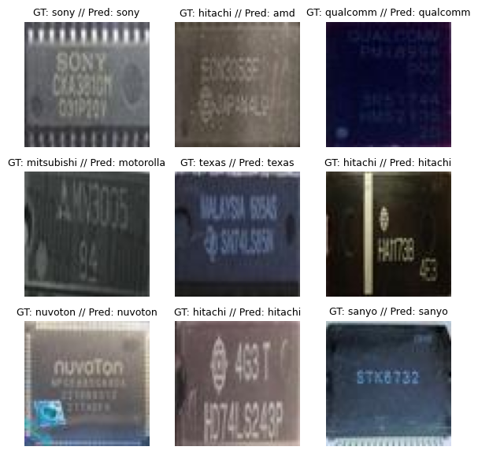

## Identifying semiconductor manufacturer through images

This respository contains code for multiple approaches to use computer vision to identify the vendor who made a semiconductor. Semiconductor chips look fairly similar at times, and telling them apart can be challenging. This project approaches this problem with convolutional neural networks, a tried and tested CV method to solve classification problems. Code is in a mix of Keras and PyTorch.

### Approaches

I largely rely on VGG16 as a backbone, re-using the ImageNet weights. This model was initially trained to classify [1000 object classes](https://deeplearning.cms.waikato.ac.nz/user-guide/class-maps/IMAGENET/) in images. I re-use its feature extraction capabilities to identify 27 manufacturer classes.

- **Post-VGG**: Use VGG16 purely as a feature extractor to obtain [2 x 2 x 512] image representations; flatten these and pass through a classification neural net of 2 layers (aka classification head).
- **Post-VGG-Aug**: Use VGG16 as a feature extractor, but to counter the small dataset size and overfitting tendencies, add data augmentation (random horizontal flipping and random rotation) before the input layer.
- **FT-VGG-AUG**: Continue using VGG16 as feature extractor and an augmentation step, but instead of using backprop only on the classification head, backprop the loss on the last 4–6 layers of VGG as well, fine-tuning them for our application.

### Evaluation
| Model    | Accuracy | Top-3 Accuracy | Macro F1
| -------- | -------   | ------ | -----|
Post-VGG  | 47.999 | 70.431 | 38.854|
Post-VGG-Aug |  54.274 |  75.137 | 44.843 |
**VGG-FT-Aug**  |  **75.843** |  **88.941**  | **68.355** |

Fine-tuning (VGG-FT-Aug) performs the best. Some other things learnt through experimentation:
- *Initialization*: Xavier initialization leads to lower initial loss and smoother training
- *Data augmentation*: Significantly improves generalization, helps with validation loss immediately
- *Preprocessing*: Scaling RGB values from [0,255] to [0,1] improves training stability and performance
- *Learning rate*: a low learning rate for more epochs does much better than high LR with weight decay methods for fewer epochs

Public training logs for VGG-FT-Aug are available at this WandB [dashboard](https://wandb.ai/muhammadali/ic-chip-net).

### Repo Structure

- `train.ipynb` contains training code for all three models. If you re-run, models will be exported to the `models/` directory.
- `evaluate.ipynb` has handy functions to re-run evaluations and build a comparison table
- `visualize.ipynb` has utilities to visualize training and test data
- The `data/` directory contains train, val and test data downloaded from [IC-ChipNet](https://vision.soic.indiana.edu/ic-chipnet/).
- `data.py` and `config.py` contains classes for dataset and training configuration for quick experimentation

**Credits**: Many thanks to Reza and Crandall (2020) for putting together the [IC-ChipNet](https://vision.soic.indiana.edu/ic-chipnet/) data used here. Image credits to Wikipedia, François Chollet. General idea and many code snippets of the three approaches also from [Deep Learning with Python](https://www.manning.com/books/deep-learning-with-python)'s computer vision chapter.